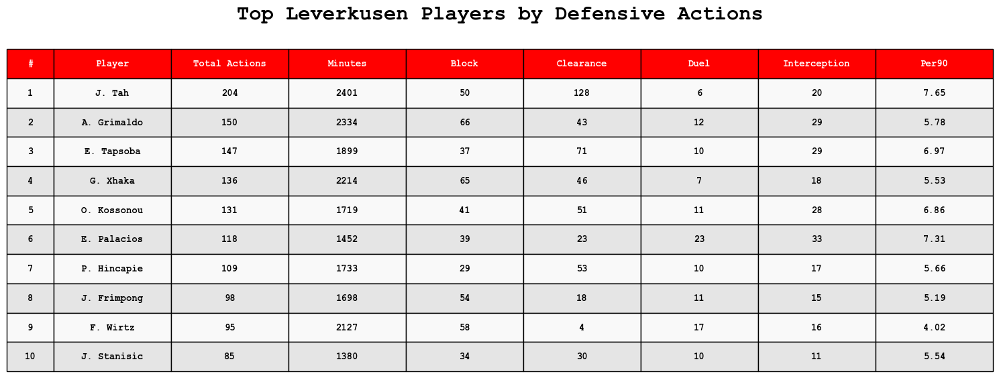
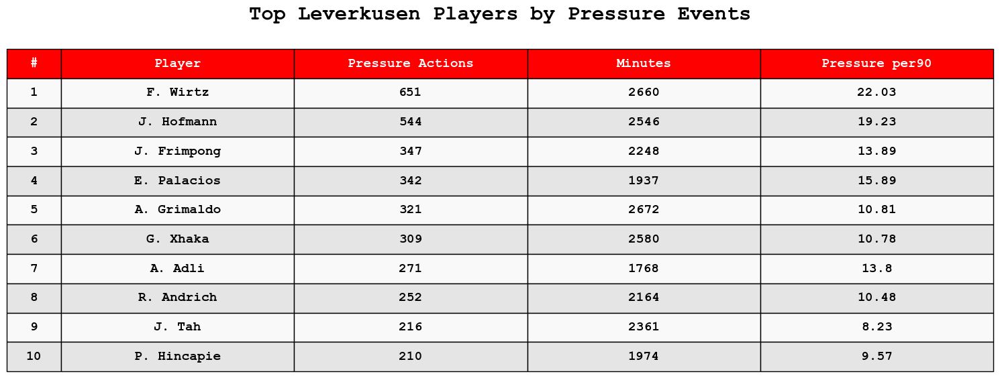
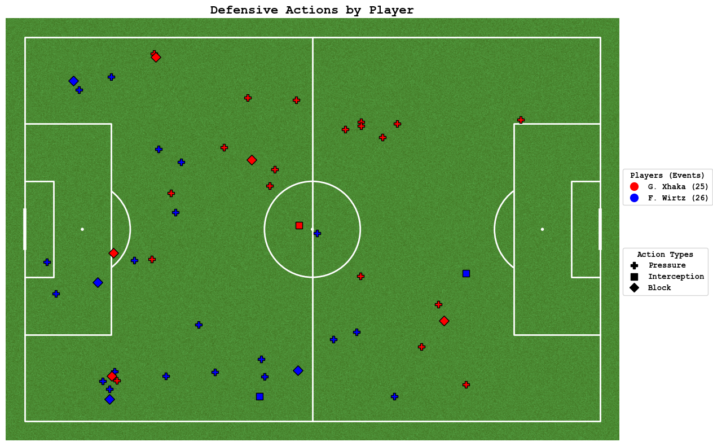
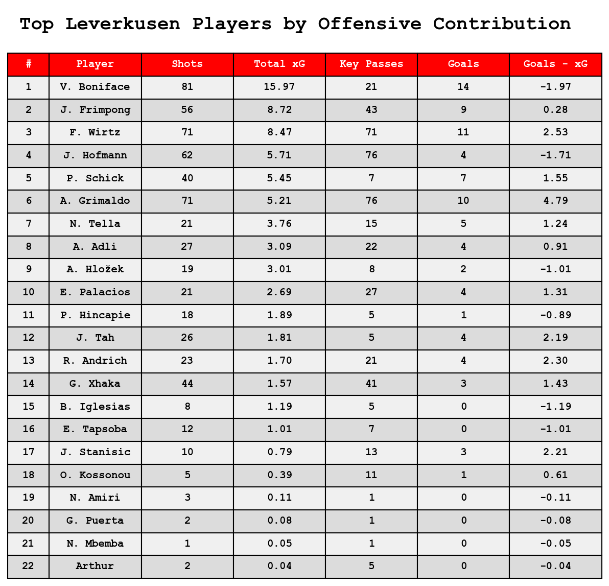
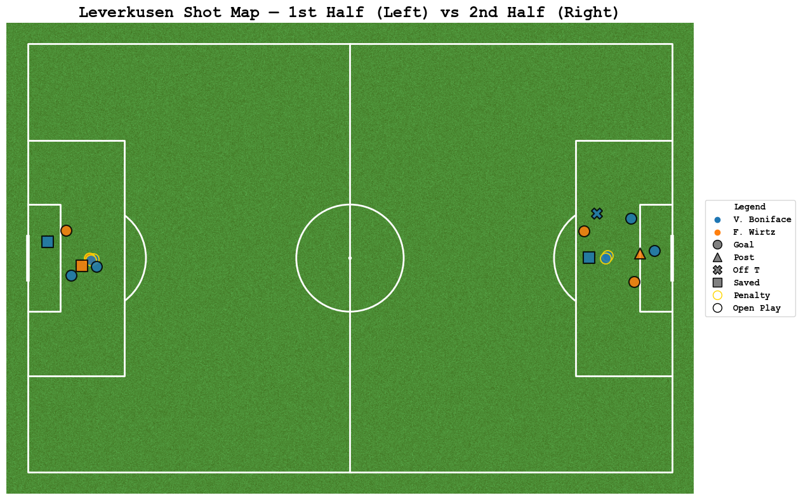

# ⚽ Bayer Leverkusen 2023/24 – Football Data Analysis Project

This project showcases a complete performance analysis of Bayer Leverkusen in the 2023/24 Bundesliga season. The data is collected via the [StatsBomb](https://statsbomb.com) API and visualized using Python.

---

## 📦 Tools & Libraries

- **Data Source**: StatsBombPy
- **Language**: Python
- **Visualization**: matplotlib, mplsoccer
- **Data Wrangling**: pandas, numpy
- **Pitch Drawing**: mplsoccer

---

## 📊 Project Highlights

### 1. 🛡️ Defensive Actions Summary

- Defensive event filtering: Duel (won), Block, Interception, Clearance, Pressure.
- Top players ranked by **total actions** and **per90 performance**.



---

### 2. 🔵 Pressure Events Analysis

- Count of pressure actions and per90 metrics for pressing intensity analysis.



---

### 3. 📍 Defensive Action Map

Visualizes the location and type of defensive events for selected players (e.g., Xhaka, Wirtz).



---

### 4. 🎯 Offensive Metrics Summary

- Shots, Total xG, Goals, Key Passes
- Finishing Efficiency: Goals - xG



---

### 5. 🎯 Shot Map – xG Contextualized

Multi-dimensional shot plot:
- Color → Player
- Marker → Outcome
- Edge color → Shot type
- Left half = 1st half shots, right half = 2nd half



---

## 🧠 Why This Matters?

- Shows how to preprocess event data from multiple matches.
- Combines quantitative and visual storytelling.
- Ready-to-use for professional club performance analysis, scouting reports, or media content.

---

## 🧰 Run it Yourself

```bash
pip install -r requirements.txt
